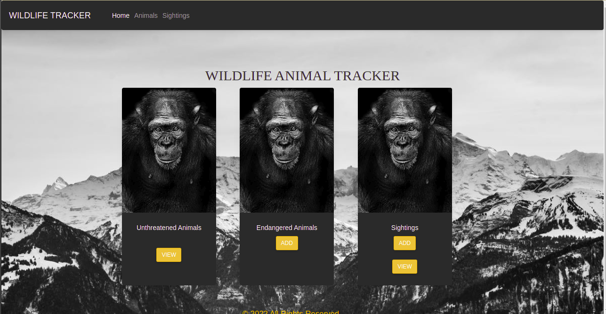

# Wildlife-tracker
##### By Sylvia Chepkoech
### This is an application  that enables rangers to track wildlife sightings in Doughlas Fir.
## Table of Content
+ [Description](#description)
+ [Installation Requirement](#Installation)
+ [Technology Used](#technology-used)
+ [Reference](#reference)
+ [Contact Info](#Support and Contact details)

## Demo


## Live link
https://wildlife-tracking-forest.herokuapp.com/

## Installation
### Requirements
* Either a computer,phone,tablet or an Ipad
* Access to the Internet
## Technology Used
* Java
* Spark
* Gradle.
* Maven.
* Bootstrap.
* JUnit.
### SetUp instructions and installation
* Clone this repository to a location in your file system.
* Open terminal command line then navigate to the root folder of the application.
  ```
    $ git clone  https://github.com/Sylvia-Chepkoech/Wildlife-Tracker.git
    $ cd ../path/to/the/file
  
   ```
[Go Back to the top](#Wildlife-tracker)

## SQL
 ```
 1.Launch postgres

2.Type in psql

Run these commands

3. CREATE DATABASE wildlife_tracker;

4. \c wildlife_tracker;

5. CREATE TABLE animals (id serial PRIMARY KEY, name varchar, health varchar, age varchar, type varchar);

6. CREATE TABLE wildlife_tracker=# CREATE TABLE sightings (id serial PRIMARY KEY, animal_id int, location varchar, ranger_name varchar, timestamp timestamp);

7. CREATE DATABASE wildlife_tracker_test WITH TEMPLATE wildlife_tracker;
  ```
## Behaviour Driven Development
* The user is able to add a sighting of an endangered animal or unthreatened animaland or view it.
* On selecting endangered , there is a form that the user is prompted to;
    * Input - Enter animal's name
    * Input - Enter animal's age.
    * Input - Enter animal's health status.
    * output - A list f the animals.
* On the sighting form, user is prompted;
    * Input - Enter animal's name.
    * Input - Enter animal's type(eithre endangered or unthreatened).
    * Input - Enter the ranger's info(name,badge number,contact information).
    * Input - Enter the location of the sighting.
    * output - A list of the sightings


[Go Back to the top](#Wildlife-tracker)
## DevelopMent
 <p> Need to contribute?? Follow the following steps.</p>

* Fork the repo
* Create a new branch
 ```
  $ git switch -c (improve-feature)
  ```
* Make the required changes in the file.
* Add changes to reflect the changes made.
* Commit your changes.
  ```
  $ git commit -am (improve-feature)
  ```
* Push to the branch
  ```
  $ git push origin (improve-feature)
   ```
* Create a Pull Request

## Support and Contact details
 <p>In case of any queries you can reach out via email; sylvia.chepkoech@student.moringaschool.com</p>

## License
MIT License

Copyright (c) 2022 Sylvia-Chepkoech

Permission is hereby granted, free of charge, to any person obtaining a copy
of this software and associated documentation files (the "Software"), to deal
in the Software without restriction, including without limitation the rights
to use, copy, modify, merge, publish, distribute, sublicense, and/or sell
copies of the Software, and to permit persons to whom the Software is
furnished to do so, subject to the following conditions:

The above copyright notice and this permission notice shall be included in all
copies or substantial portions of the Software.

THE SOFTWARE IS PROVIDED "AS IS", WITHOUT WARRANTY OF ANY KIND, EXPRESS OR
IMPLIED, INCLUDING BUT NOT LIMITED TO THE WARRANTIES OF MERCHANTABILITY,
FITNESS FOR A PARTICULAR PURPOSE AND NONINFRINGEMENT. IN NO EVENT SHALL THE
AUTHORS OR COPYRIGHT HOLDERS BE LIABLE FOR ANY CLAIM, DAMAGES OR OTHER
LIABILITY, WHETHER IN AN ACTION OF CONTRACT, TORT OR OTHERWISE, ARISING FROM,
OUT OF OR IN CONNECTION WITH THE SOFTWARE OR THE USE OR OTHER DEALINGS IN THE
SOFTWARE.